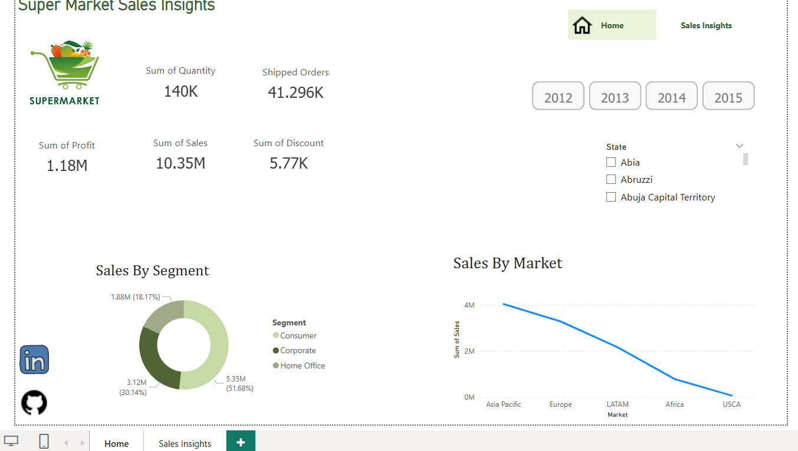
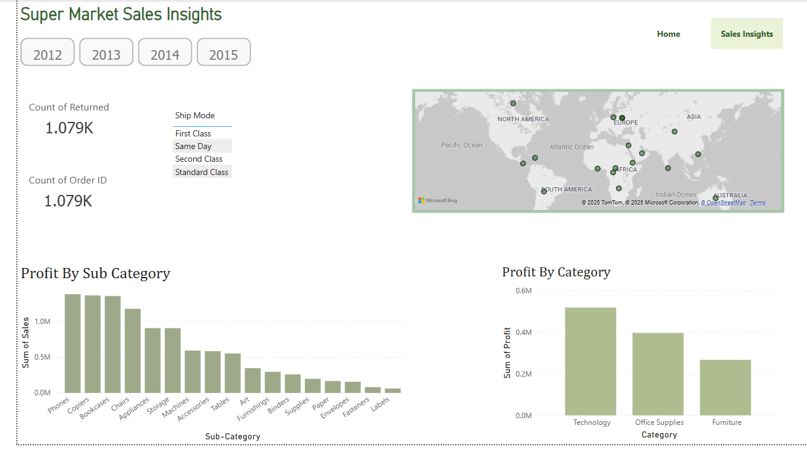

# 📊 Super Market Sales Analysis

## 🛠 Tools Used
- **Power BI**
- **Data Visualization & Analytics**
- **DAX (Data Analysis Expressions)**

---

## 📌 Project Overview
This project aims to analyze and visualize supermarket sales data to gain insights into key metrics such as total sales, profit, quantity sold, and discounts offered. The dashboard provides an interactive experience to explore sales trends across different years, markets, segments, and product categories.

---

## 📷 Dashboard Visuals

### 🔹 Sales Insights Overview

#### Key Metrics:
- **Total Sales**: 10.35M
- **Total Profit**: 1.18M
- **Total Quantity Sold**: 140K
- **Total Shipped Orders**: 41.296K
- **Total Discount Given**: 5.77K

#### Features:
✅ Year slicers (2012, 2013, 2014, 2015) for dynamic filtering.  
✅ Sales distribution by **segment** (Consumer, Corporate, Home Office).  
✅ Sales trend across different **markets** (Asia Pacific, Europe, LATAM, Africa, USCA).  

---

### 🔹 Sales & Profit Analysis

#### Key Insights:
- **Returned Orders**: 1.079K (Indicates customer dissatisfaction trends).
- **Profitability by Sub-Category**: Phones, Copiers, and Chairs generate the highest sales.
- **Profitability by Category**:
  - **Technology** contributes the most to profit.
  - **Office Supplies** and **Furniture** have significant but lower profit margins.
- **Geographic Sales Distribution**: Sales mapped globally to analyze regional performance.

---

## 🎯 Business Impact
📌 Helps retailers understand which **products** drive the most revenue and profit.  
📌 Identifies trends in **customer purchase behavior** over different years.  
📌 Provides insights into **returns and discount impacts** on overall revenue.  
📌 Enables **data-driven decision-making** for product stocking and pricing strategies.  

---

## 🚀 How to Use This Dashboard
1. Open the **Power BI file** (.pbix) to interact with the data.
2. Use **year filters** to analyze specific time periods.
3. Click on **segments, categories, and locations** for drill-down insights.
4. Observe trends in **sales, profit, and returns** to identify actionable strategies.

---

## 💡 Future Enhancements
🔹 Adding **forecasting models** to predict future sales trends.  
🔹 Implementing **customer segmentation** for targeted marketing.  
🔹 Enhancing **interactivity** with drill-through reports.

---

## 🏆 Conclusion
This **Super Market Sales Analysis** dashboard provides an in-depth look at key sales metrics, helping businesses optimize their decision-making process using **data-driven insights**. The interactive elements allow for **easy exploration** of trends, profitability, and sales distribution across various categories.

